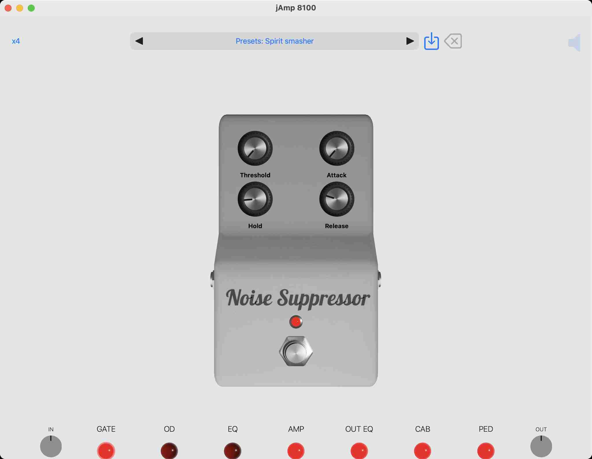
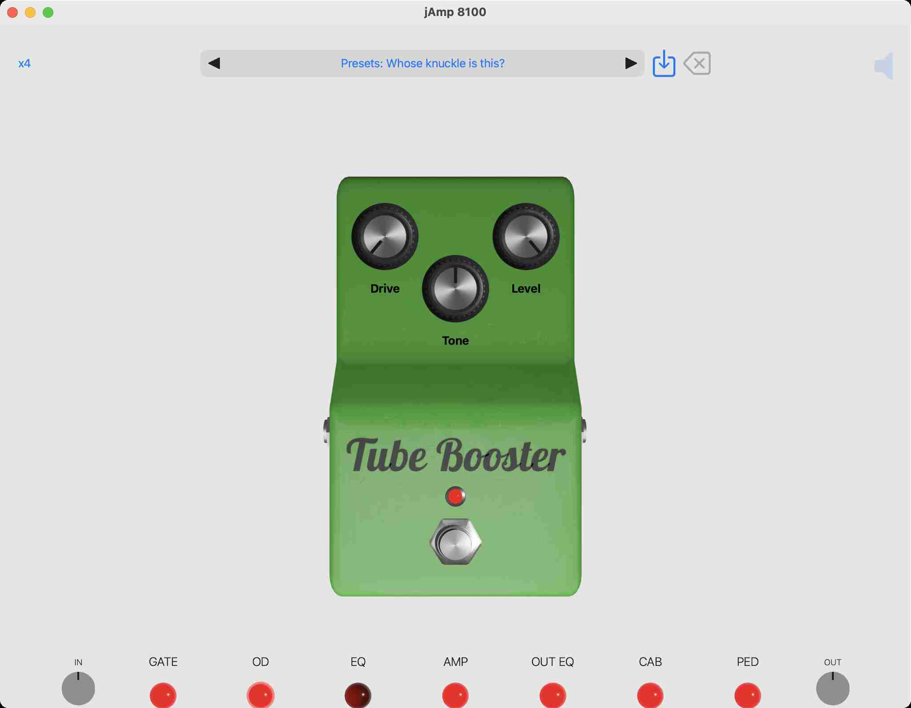
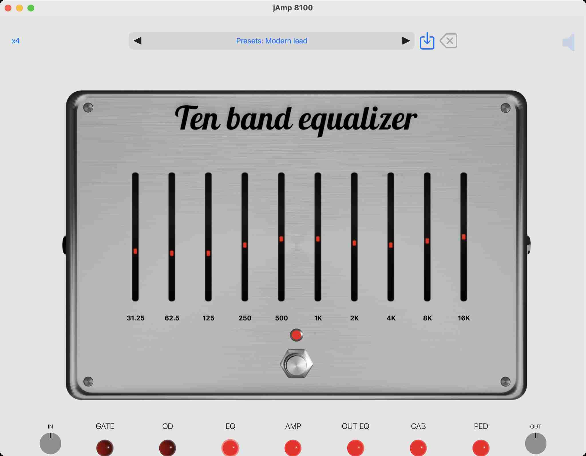
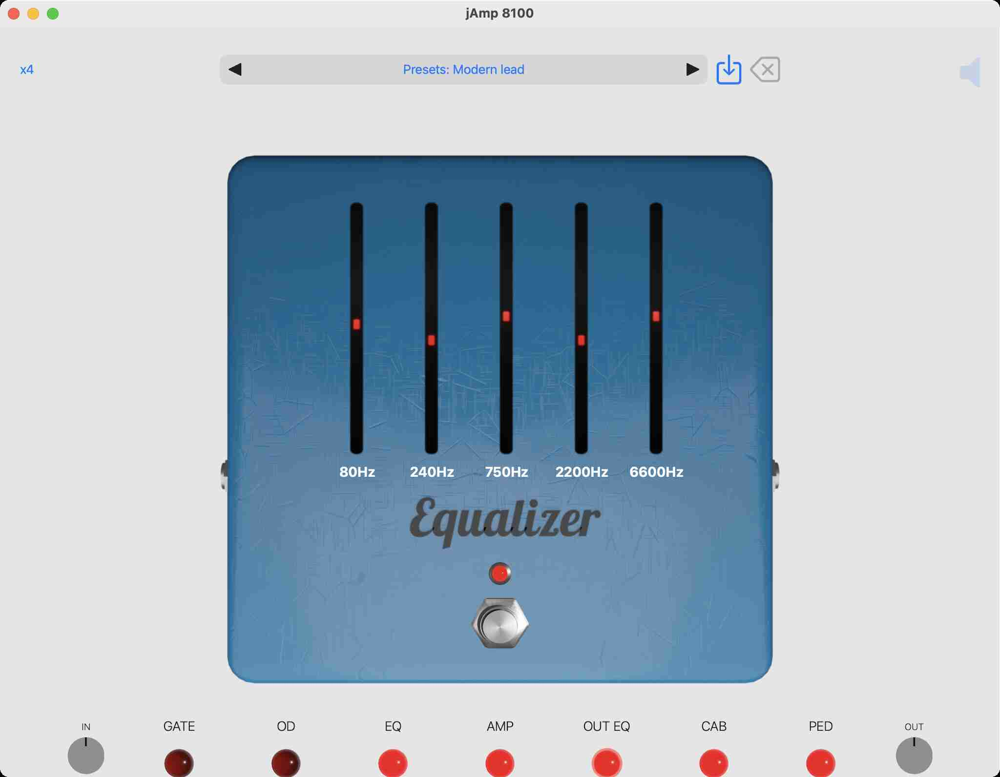

# jAmp 8100 (AUv3) manual

Welcome to the jAmp 8100 manual! We are thrilled to present you with a powerful and immersive digital emulation of the iconic Marshall VS8100 amplifier, designed to take your guitar playing experience to new heights. Whether you're a seasoned musician, a passionate enthusiast, or a beginner exploring the world of rock and roll, this manual will guide you through every aspect of our cutting-edge software, helping you unleash the raw potential of this legendary amplifier right at your fingertips.

Inside this manual, you'll find a comprehensive overview of the software's features, functionalities, and how to navigate its user-friendly interface. We'll walk you through the diverse range of authentic tones and effects that this simulation offers, providing you with the tools to replicate the distinct Marshall sound that has defined countless music genres.

From the classic, warm tones of vintage blues, over the roaring power chords of hard rock, to the vintage Death metal tones of the '90s, the jAmp 8100 audio plugin has been painstakingly crafted to deliver an unparalleled auditory experience. Join us on this journey as we dive into the world of virtual amplification and unleash the potential of your guitar rig like never before.

So, strap in, plug in your guitar, and get ready to rock out with the jAmp 8100 – the perfect blend of innovation and tradition for the modern guitarist. Let's dive in and discover the limitless possibilities that await you in this digital realm of sonic excellence. Get ready to inspire, create, and elevate your music to a whole new level!

## System requirements

jAmp 8100 is an AUv3 (Audio Unit version 3) plugin that can be used as a stand-alone application on iOS and macOS, or as an audio plugin inside a host application on iOS and macOS. 

Minimal requirements are:
  - iOS 14.0 or later for mobile (iPhone or iPad)
  - macOS 11.0 or later for desktop / laptop

The jAmp 8100 software is distributed via the Apple App store. Click on the App store badge to go to the download location.

## Purchase info

Installation of jAmp 8100 is free, but it will run in DEMO mode. This means that every minute jAmp 8100 will output 3 seconds of silence. This allows the user to test the audio plugin in depth before purchasing it.

Purchasing jAmp 8100 is a straightforward and user-friendly process, following the standard steps from the Apple App Store you're likely familiar with. Once the plugin is unlocked, the DEMO mode will be gone, and you can enjoy the full potential.

To start the payment process you have to run jAmp 8100 in stand-alone mode. A popup as in the image above should appear. Simply tap or click on "Purchase" and the Apple App Store will guide you through the process.

Note that you should only pay once to unlock the plugin. In case you have a new device, you can get the plugin unlocked by clicking on "Restore". If you go a second time through the payment system, no worries, Apple will notice this and give you the plugin for free.

Note that it is not possible to purchase the audio plugin via a host application. If you run jAmp 8100 via for instance GarageBand you will get a message as in the image above. Just start the stand-alone jAmp 8100 application if you want to purchase.

## AMP section

### Front panel features

#### Normal channel

##### Clean

This controls the volume of the Normal channel.

##### Clean / Crunch 

This button will crunch up your guitar sound for semi-distorted chords. The amount of distortion will be controlled by the Clean control.

##### Bass

The Bass control allows you to shape the low-end frequencies of your guitar's tone. Turn the knob clockwise to increase the bass for added depth and warmth, or counterclockwise to decrease it for a tighter and punchier sound. 

##### Middle

The Middle control enables you to adjust the mid-range frequencies of your guitar's tone. By turning the knob clockwise, you can boost the mids for a fatter sound. Conversely, turning it counterclockwise reduces the mid-range for obtaining a thinner sound.

##### Treble

The Treble control empowers you to shape the high-frequency content of your guitar's sound. When turned clockwise, it boosts the treble, adding brilliance and sparkle to your tone.

#### Channel select

Allows for switching between the Normal and Boost channel.

#### Boost channel

##### Gain

This control governs the input signal from your guitar and the level of gain within the pre-amp while using the Boost channel. Raising the gain enhances the distortion in your guitar sound and, to some degree, boosts the volume. Keeping the gain at a lower level will yield a vintage-style blues crunch, while turning it up will produce higher gain sounds, perfectly suited for classic rock tones.

##### OD1 / OD2

Switches between Overdrive 1 and Overdrive 2. Overdrive 2 takes off where Overdrive 1 finishes, boosting the amplication factor even more.

##### Bass

The Bass control allows you to shape the low-end frequencies of your guitar's tone. When using a heavily distorted tone, turning the knob clockwise will make the tone darker and heavier.

##### Middle

The Middle control enables you to adjust the mid-range frequencies of your guitar's tone. By turning the knob clockwise, you can boost the mids for a fatter sound. Conversely, turning it counterclockwise reduces the mid-range for obtaining a thinner sound.

##### Treble

The Treble control empowers you to shape the high-frequency content of your guitar's sound. When turned clockwise, it boosts the treble, adding brilliance and sparkle to your tone.

##### Contour

The Contour control alters the mid-range frequencies in your guitar tone. Turning the Contour knob fully clockwise removes most of the middle frequencies, creating a 'thrash' tone when combined with heavy distortion, high Treble, and Bass settings, ideal for aggressive rhythms and fierce leads. On the other hand, turning the Contour knob fully anti-clockwise produces excellent fusion-type tones. Experiment with this control to discover the perfect setting for your style. If unsure, keeping the control at 12 o'clock is a good starting point.

##### Volume

Controls the volume of the Boost channel.

#### Master

##### Reverb

Reverb will add ambience and size to your guitar tone, giving the effect of playing in a large empty room or hall.
This knob controls the amount of reverb.

##### Volume

Controls the main output volume.

##### Cab

Turns on / off the cabinet loader section. When turned off you can add any other custom cabinet loader to your stack of audio plugins to simulate the desired cabinet sound effect.

##### Power sim

Turns on / off the power amplifier simulation. When turned off the output volume will be louder and you will hear some hard clipping which is less appealing to the ear. This option however allows to add another custom power amplifier to your stack of audio plugins.

##### Power

Turns on / off the amplifier. Can be useful in case you only want to use some of the pedals.

### Top row

### Bottom row

## GATE section

## OD section

## EQ section

## OUT EQ section

## CAB section

## PED section

## Credits

- [AudioKit Controls](https://github.com/AudioKit/Controls)
- [Cabinet IRs by forward-audio.com](https://www.forward-audio.com)
- [Cabinet IRs by Valhallir.at](https://valhallir.at)
- [DSP Filters by Vinnie Falco](https://github.com/vinniefalco/DSPFilters)
- [File Picker by Mark Renaud](https://github.com/markrenaud/FilePicker)
- [Lobster font](https://github.com/impallari/The-Lobster-Font)
- [R-Solver](https://github.com/jatinchowdhury18/R-Solver)
- [SwiftUI animation by Finsi Ennes](https://github.com/KeatoonMask/SwiftUI-Animation)
