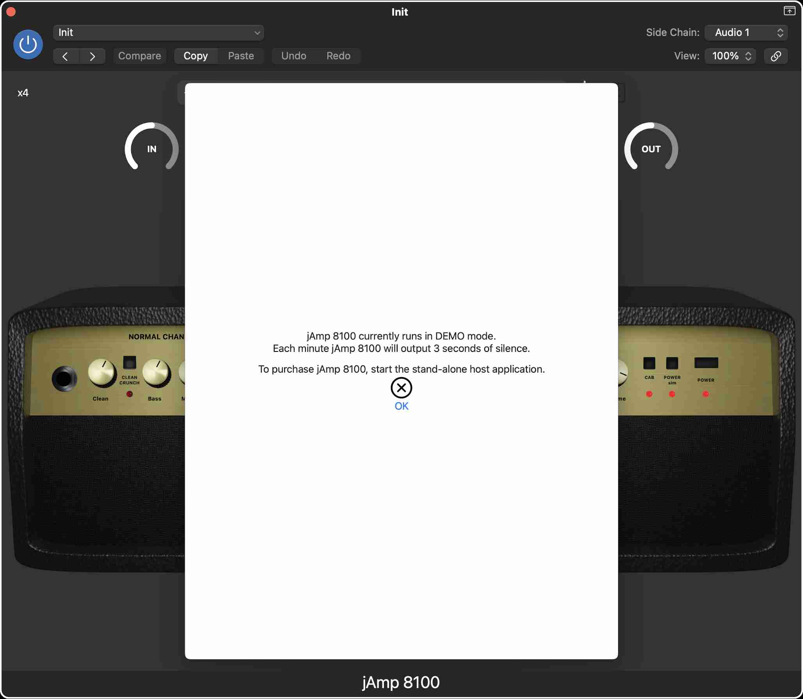

# jAmp 8100 (AUv3) manual

Welcome to the jAmp 8100 manual! We are thrilled to present you with a powerful and immersive digital emulation of the iconic Marshall VS8100 amplifier, designed to take your guitar playing experience to new heights. Whether you're a seasoned musician, a passionate enthusiast, or a beginner exploring the world of rock and roll, this manual will guide you through every aspect of our cutting-edge software, helping you unleash the raw potential of this legendary amplifier right at your fingertips.

Inside this manual, you'll find a comprehensive overview of the software's features, functionalities, and how to navigate its user-friendly interface. We'll walk you through the diverse range of authentic tones and effects that this simulation offers, providing you with the tools to replicate the distinct Marshall sound that has defined countless music genres.

From the classic, warm tones of vintage blues, over the roaring power chords of hard rock, to the vintage Death metal tones of the '90s, the jAmp 8100 audio plugin has been painstakingly crafted to deliver an unparalleled auditory experience. Join us on this journey as we dive into the world of virtual amplification and unleash the potential of your guitar rig like never before.

So, strap in, plug in your guitar, and get ready to rock out with the jAmp 8100 – the perfect blend of innovation and tradition for the modern guitarist. Let's dive in and discover the limitless possibilities that await you in this digital realm of sonic excellence. Get ready to inspire, create, and elevate your music to a whole new level!

## System requirements

jAmp 8100 is an AUv3 (Audio Unit version 3) plugin that can be used as a stand-alone application on iOS and macOS, or as an audio plugin inside a host application on iOS and macOS. 

Minimal requirements are:
  - iOS 14.0 or later for mobile (iPhone or iPad)
  - macOS 11.0 or later for desktop / laptop

The jAmp 8100 software is distributed via the Apple App store. Click on the App store badge to go to the download location.

## Purchase info

Installation of jAmp 8100 is free, but it will run in DEMO mode. This means that every minute jAmp 8100 will output 3 seconds of silence. This allows the user to test the audio plugin in depth before purchasing it.

Purchasing jAmp 8100 is a straightforward and user-friendly process, following the standard steps from the Apple App Store you're likely familiar with. Once the plugin is unlocked, the DEMO mode will be gone, and you can enjoy the full potential.

To start the payment process you have to run jAmp 8100 in stand-alone mode. A popup as in the image above should appear. Simply tap or click on "Purchase" and the Apple App Store will guide you through the process.

Note that you should only pay once to unlock the plugin. In case you have a new device, you can get the plugin unlocked by clicking on "Restore". If you go a second time through the payment system, no worries, Apple will notice this and give you the plugin for free.

Note that it is not possible to purchase the audio plugin via a host application. If you run jAmp 8100 via for instance GarageBand you will get a message as in the image above. Just start the stand-alone jAmp 8100 application if you want to purchase.

