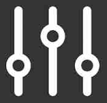
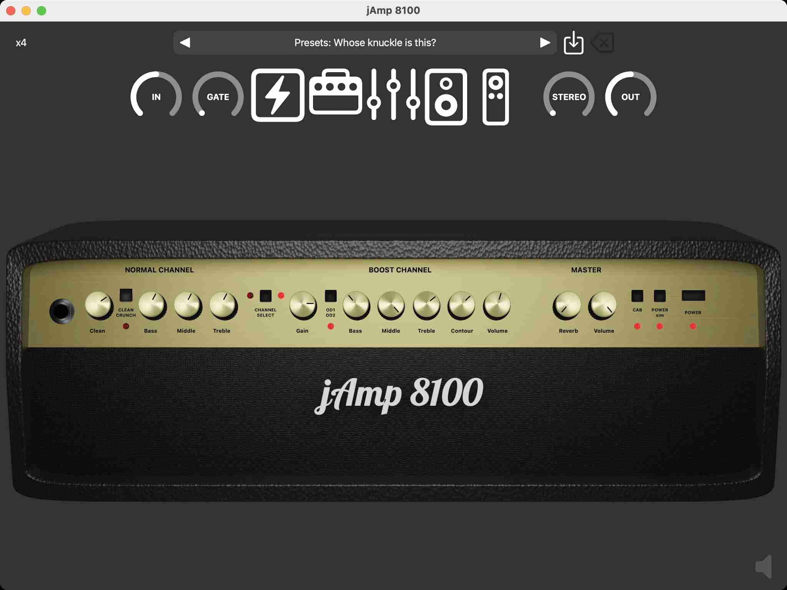
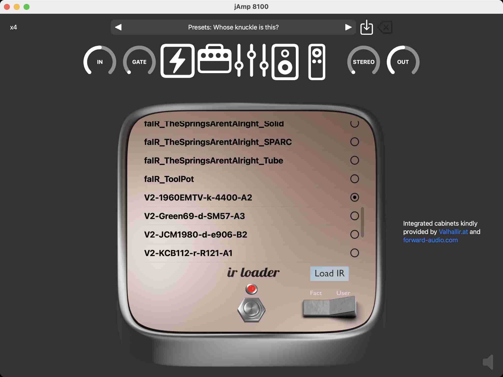
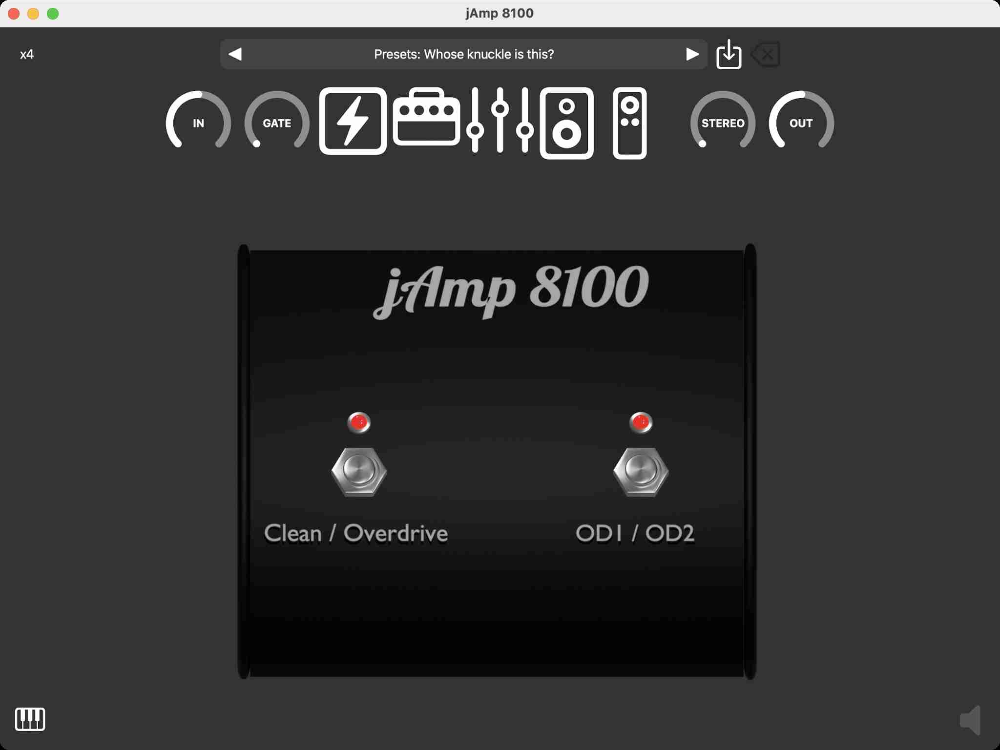

# jAmp 8100 (AUv3) manual

Welcome to the jAmp 8100 manual! We are thrilled to present you with a powerful and immersive digital emulation of the iconic Marshall VS8100 amplifier, designed to take your guitar playing experience to new heights. Whether you're a seasoned musician, a passionate enthusiast, or a beginner exploring the world of rock and roll, this manual will guide you through every aspect of our cutting-edge software, helping you unleash the raw potential of this legendary amplifier right at your fingertips.

Inside this manual, you'll find a comprehensive overview of the software's features, functionalities, and how to navigate its user-friendly interface. We'll walk you through the diverse range of authentic tones and effects that this simulation offers, providing you with the tools to replicate the distinct Marshall sound that has defined countless music genres.

From the classic, warm tones of vintage blues, over the roaring power chords of hard rock, to the vintage Death metal tones of the '90s, the jAmp 8100 audio plugin has been painstakingly crafted to deliver an unparalleled auditory experience. Join us on this journey as we dive into the world of virtual amplification and unleash the potential of your guitar rig like never before.

So, strap in, plug in your guitar, and get ready to rock out with the jAmp 8100 – the perfect blend of innovation and tradition for the modern guitarist. Let's dive in and discover the limitless possibilities that await you in this digital realm of sonic excellence. Get ready to inspire, create, and elevate your music to a whole new level!

## System requirements

jAmp 8100 is an AUv3 (Audio Unit version 3) plugin that can be used as a stand-alone application on iOS and macOS, or as an audio plugin inside a host application on iOS and macOS. 

Minimal requirements are:
  - iOS 14.0 or later for mobile (iPhone or iPad)
  - macOS 11.0 or later for desktop / laptop

The jAmp 8100 software is distributed via the Apple App store. Click on the App store badge to go to the download location.

## Purchase info

Installation of jAmp 8100 is free, but it will run in DEMO mode. This means that every minute jAmp 8100 will output 3 seconds of silence. This allows the user to test the audio plugin in depth before purchasing it.

Purchasing jAmp 8100 is a straightforward and user-friendly process, following the standard steps from the Apple App Store you're likely familiar with. Once the plugin is unlocked, the DEMO mode will be gone, and you can enjoy the full potential.

To start the payment process you have to run jAmp 8100 in stand-alone mode. A popup as in the image above should appear. Simply tap or click on "Purchase" and the Apple App Store will guide you through the process.

Note that you should only pay once to unlock the plugin. In case you have a new device, you can get the plugin unlocked by clicking on "Restore". If you go a second time through the payment system, no worries, Apple will notice this and give you the plugin for free.

Note that it is not possible to purchase the audio plugin via a third-party host application. If you run jAmp 8100 via for instance GarageBand you will get a message as in the image above. Just start the stand-alone jAmp 8100 application if you want to purchase.

## Navigation bar

The navigation bar at the top of your view consists of two rows. The top row controls the oversampling rate and the preset section. The second row represents the signal chain flow. We can navigate via icons to the different sections (pre-amp effects, amplifier, post-amp effects, cabinet simulation, and pedal), and we can control the input and output level and the noise gate.

### Top row

At the top left you can control the amount of oversampling. Generally, the more oversampling that is used, the better the simulation will be. The default oversampling rate is x4 and the amplifier is tweaked to sound best for this oversampling rate. If you go to a lower oversampling rate (x1 or x2), the plugin will be less demanding for your CPU but the sound quality is less. It is advised to keep the oversampling rate at x4 if your CPU can handle it.

In the middle we have the preset section. There are a bunch of factory settings that you can experiment with. Furthermore, you can also save your own user settings. The icon with the arrow pointing downward will allow you to save your preset. A popup will show up asking you for the name of your user preset. If the suggested name is colored red, it means that you will overwrite an already existing user preset. You can also delete a user preset by tapping or clicking on the icon with the X mark. Note that you cannot delete factory settings.

### Signal chain row

Control the signal input

Control the noise gate. If the knob is turned down all the way to -70dB, the noise gate is actually switched off.
The threshold control determines the level at which the noise suppression effect is activated. When set, the noise suppressor remains inactive until the incoming audio signal drops below the specified threshold level. Once the noise suppressor engages, the input signal will be reduced or eliminated (depending on your chosen settings with the other controls). Adjusting the threshold control allows you to tailor the noise suppression to your specific setup, ensuring a clean and noise-free performance while still preserving your desired guitar tones and sustain.

Go to the pre-amp effect section (compressor, overdrive and chorus)

Go to the amplifier section

Go to the post-amp effect section (equalizer and chorus)

Go to the cabinet simulation section

Go to the pedal

Control the signal output

## AMP section

### Front panel features

#### Normal channel

##### Clean

This controls the volume of the Normal channel.

##### Clean / Crunch 

This button will crunch up your guitar sound for semi-distorted chords. The amount of distortion will be controlled by the Clean control.

##### Bass

The Bass control allows you to shape the low-end frequencies of your guitar's tone. Turn the knob clockwise to increase the bass for added depth and warmth, or counterclockwise to decrease it for a tighter and punchier sound. 

##### Middle

The Middle control enables you to adjust the mid-range frequencies of your guitar's tone. By turning the knob clockwise, you can boost the mids for a fatter sound. Conversely, turning it counterclockwise reduces the mid-range for obtaining a thinner sound.

##### Treble

The Treble control empowers you to shape the high-frequency content of your guitar's sound. When turned clockwise, it boosts the treble, adding brilliance and sparkle to your tone.

#### Channel select

Allows for switching between the Normal and Boost channel.

#### Boost channel

##### Gain

This control governs the input signal from your guitar and the level of gain within the pre-amp while using the Boost channel. Raising the gain enhances the distortion in your guitar sound and, to some degree, boosts the volume. Keeping the gain at a lower level will yield a vintage-style blues crunch, while turning it up will produce higher gain sounds, perfectly suited for classic rock tones.

##### OD1 / OD2

Switches between Overdrive 1 and Overdrive 2. Overdrive 2 takes off where Overdrive 1 finishes, boosting the amplication factor even more.

##### Bass

The Bass control allows you to shape the low-end frequencies of your guitar's tone. When using a heavily distorted tone, turning the knob clockwise will make the tone darker and heavier.

##### Middle

The Middle control enables you to adjust the mid-range frequencies of your guitar's tone. By turning the knob clockwise, you can boost the mids for a fatter sound. Conversely, turning it counterclockwise reduces the mid-range for obtaining a thinner sound.

##### Treble

The Treble control empowers you to shape the high-frequency content of your guitar's sound. When turned clockwise, it boosts the treble, adding brilliance and sparkle to your tone.

##### Contour

The Contour control alters the mid-range frequencies in your guitar tone. Turning the Contour knob fully clockwise removes most of the middle frequencies, creating a 'thrash' tone when combined with heavy distortion, high Treble, and Bass settings, ideal for aggressive rhythms and fierce leads. On the other hand, turning the Contour knob fully anti-clockwise produces excellent fusion-type tones. Experiment with this control to discover the perfect setting for your style. If unsure, keeping the control at 12 o'clock is a good starting point.

##### Volume

Controls the volume of the Boost channel.

#### Master

##### Reverb

Reverb will add ambience and size to your guitar tone, giving the effect of playing in a large empty room or hall.
This knob controls the amount of reverb.

##### Volume

Controls the main output volume.

##### Cab

Turns on / off the cabinet loader section. When turned off you can add any other custom cabinet loader to your stack of audio plugins to simulate the desired cabinet sound effect.

##### Power sim

Turns on / off the power amplifier simulation. When turned off the output volume will be louder and you will hear some hard clipping which is less appealing to the ear. This option however allows to add another custom power amplifier to your stack of audio plugins.

##### Power

Turns on / off the amplifier. Can be useful in case you only want to use some of the pedals.

## Pre amp effect section

The Tube Booster is a digital emulation of the legendary Ibanez Tube Screamer. This pedal is a timeless classic cherished by guitarists across generations for its unparalleled ability to add warmth, smoothness, and that elusive "scream" to your guitar tone.

### Drive

The Drive control determines the amount of overdrive or distortion applied to your guitar signal.

### Tone

Acting as a high-frequency filter, the Tone knob allows you to adjust the brightness or darkness of the sound to suit your preferences and playing style.

### Level

The Level control determines the output volume of the pedal. 

### Foot switch 

Turn the Tube Booster on or off.

## Post-amp effect section

This is a five-band post-amp equalizer designed to shape the amplifier's sound before it reaches the cabinet.

### Frequency bands

Adjust the boost or cut of the selected band by 12dB.

### Foot switch 

Turn the equalizer on or off.

## CAB section

This cabinet simulator is designed to bring the immersive world of impulse responses to your digital audio setup. By utilizing convolution technology, the Impulse Response Loader allows you to capture the unique sonic fingerprint of real-world spaces, classic cabinets, or any acoustic environment, and apply them to your audio signals. 

The integrated cabinet impulse responses are provided by [forward-audio.com](https://www.forward-audio.com) and [Valhallir.at](https://valhallir.at). 

It is also possible to load your own impulse responses, which are expected to be in Wave format.

You can delete your own uploaded impulse responses, by long pressing/clicking the selection button on the right of the corresponding impulse response. Integrated impulses can not be deleted.

### Load IR

This button will open a file explorer where you can select your own impulse response files in Wave format.

### Fact / User

This button switches between the integrated impulse responses by [forward-audio.com](https://www.forward-audio.com) and [Valhallir.at](https://valhallir.at), and the user uploaded impulse responses.

### Foot switch 

Turn the IR loader on or off.

## PED section

Just for fun! A simulation of the iconic Marshall footswitch. Tap the Clean / Overdrive switch to toggle between the Normal and Boost channel. When the Boost channel is activated, you can tap the OD1 / OD2 switch to toggle between the two overdrive modes.

## Connect your audio interface to iPad/iPhone

You need an audio interface to connect your instrument to your mobile device. Known audio interface brands are for instance [Focusrite](https://focusrite.com) or [IK Multimedia](https://www.ikmultimedia.com/).

For iPad you might want to consider using a USB-C hub with power delivery to avoid draining your battery during your jam session, but this is optional.

Your iPhone however cannot deliver enough power on its own to feed the audio interface, so here an extra adapter is necessary that can
 1. connect via lightning port to your iPhone
 2. connect to your phone charger with USB
 3. connect to your audio interface with USB

If you have a Focusrite Scarlett 2i2 or similar you can use the [lighting to USB 3 camera adapter](https://www.amazon.com/Apple-Lightning-USB3-Camera-Adapter/dp/B01F7KJDIM?crid=YQVDGX9WA1YR&keywords=Lightning+to+USB+3+camera+adapter&qid=1641043307&sprefix=lightning+to+usb+3+camera+adapter,aps,792&sr=8-3&linkCode=sl1&tag=virtuosocentr-20&linkId=57ee7dd06d0e356aee5f53a8c03c9268&language=en_US&ref_=as_li_ss_tl) for this which is easily available in the market.

A good tutorial for connecting your audio interface to iPad/iPhone with power charge can be found [here](https://virtuosocentral.com/how-to-connect-the-focusrite-scarlett-to-iphone-or-ipad/).

## Credits

- [AudioKit Controls](https://github.com/AudioKit/Controls)
- [Cabinet IRs by forward-audio.com](https://www.forward-audio.com)
- [Cabinet IRs by Valhallir.at](https://valhallir.at)
- [DSP Filters by Vinnie Falco](https://github.com/vinniefalco/DSPFilters)
- [File Picker by Mark Renaud](https://github.com/markrenaud/FilePicker)
- [Lobster font](https://github.com/impallari/The-Lobster-Font)
- [R-Solver](https://github.com/jatinchowdhury18/R-Solver)
- [SwiftUI animation by Finsi Ennes](https://github.com/KeatoonMask/SwiftUI-Animation)
